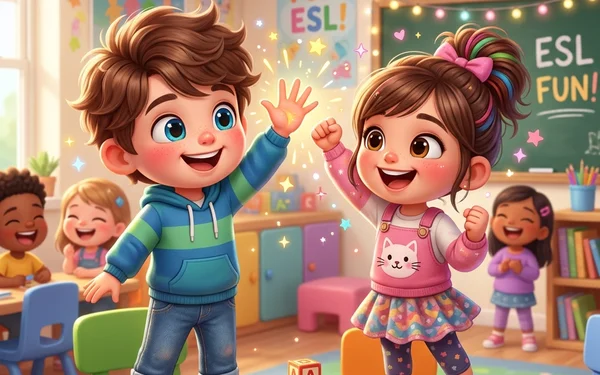

# Gesture Duo: Team Challenge (手勢默契大作戰 - ESL 雙人體感合作闖關)

專為國小英語課堂（ESL / EFL）打造的 **Web AI 視訊體感雙人合作互動遊戲**。透過電腦或筆電的視訊鏡頭與 MediaPipe Hands 機器學習模型，兩位小朋友在鏡頭前同機合作，比出「張手比五（🖐️）」與「握拳（✊）」，即時搶答日常作息與代名詞句型，挑戰最速通關排行榜！

---

## 🌟 遊戲核心特色 (Key Features)

1. **雙人合作模式（Co-op Team Challenge）**：
   - 雙人同機時，兩位小朋友皆伸出**慣用右手**，站在左邊的小朋友出在左半區、站在右邊的小朋友出在右半區，合力完成手勢考驗。
   - 單人練習模式下，一位小朋友可伸出雙手，左手在左區、右手在右區。
2. **三大練習主題（Practice Modes）**：
   - **Mode 1: What Do You Do After School?**（課本 Page 8）：
     - `I` ➔ 左張手 🖐️，右握拳 ✊
     - `You` ➔ 右張手 🖐️，左握拳 ✊
     - `We` ➔ 雙人皆張手 🖐️ + 🖐️
   - **Mode 2: Day or Night?**（課本 Page 9）：
     - 日常作息分類（如 `wake up` 屬於 Day ➔ 左張手右握拳；`go to sleep` 屬於 Night ➔ 左握拳右張手），搭配精緻教材閃卡圖片。
   - **Mode 3: Teacher's Custom Challenge（教師自訂題庫模式）**：
     - 老師可自由修改左右半區標籤名稱、新增題目英文句子、中文釋義與指定正解手勢，題目由瀏覽器 Web Speech TTS 即時朗讀。
3. **AI 視覺辨識與鏡像投影（MediaPipe Hands）**：
   - 水平鏡像投影，如同照鏡子般直覺。
   - 五指骨架伸展演算法精準區分 `OPEN_PALM` 與 `FIST`。
   - 0.35s 蓄力光環確認機制，避免晃動誤觸。
4. **極速碼錶與合作榮譽榜（Stopwatch & Leaderboard）**：
   - 毫秒級精確計時，自選 5 / 10 / 15 / ALL 關卡題數，通關後登錄團隊成績至 LocalStorage 排行榜。
5. **無鏡頭鍵盤備援機制**：
   - 支援 `A`（左區切換）、`D`（右區切換）、`W`（雙張手）、`S`（雙握拳）與點擊切換，任何設備皆可 100% 暢玩。

---

## 🚀 線上體驗與部署 (Online Demo)

- **GitHub Pages 部署網址**：`https://yehchenhsuan.github.io/V2_Gesture_Showdown/`
- **技術棧**：HTML5, Vanilla CSS, Vanilla JavaScript, MediaPipe Hands, Web Audio API, Web Speech API (TTS)。
